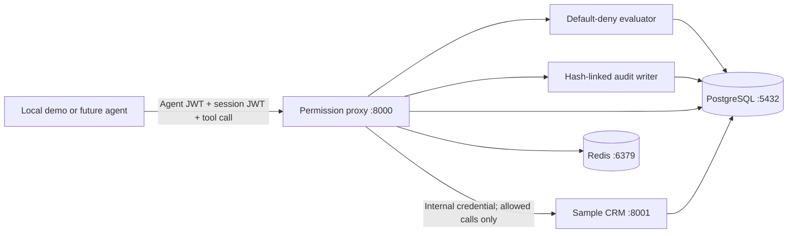

# Architecture

The solution is a small set of independently deployable Python services:

- `permission-proxy`: the policy enforcement point and only tool endpoint available to the
  AI agent.
- `sample-crm`: a separate protected tool service containing synthetic customer data.
- `reference-agent`: the LLM-driven client used for end-to-end demonstrations.
- PostgreSQL: the planned source of truth for agents, manifests, sessions, and audits.
- Redis: a derived cache for short-lived policy and session state.

Phase 5 completes the local enforcement path. The proxy authenticates the agent, validates
server-backed session context, loads and verifies the active manifest, evaluates the request,
durably records the decision, and forwards only allowed calls to the private CRM. It records
execution as a second immutable event. Real LLM orchestration and production deployment are
deferred to Phases 6-9.

## Local topology

The reference agent is behind the optional Docker Compose `agent` profile. PostgreSQL and
Redis are present from the first phase so later work does not require changing the local
operating model.

## Service conventions

- Configuration is read from validated environment variables.
- Services run as non-root users in containers.
- Logs are structured JSON on standard output.
- `/health/live` confirms that a process is responsive.
- `/health/ready` confirms configuration and database connectivity for the proxy and CRM.
- OpenAPI documentation is available at `/docs`.
- Production configuration rejects development authentication and insecure OIDC issuers.

## Production direction

AWS ECS Fargate, an Application Load Balancer, private RDS PostgreSQL, private ElastiCache,
Secrets Manager, and least-privilege IAM remain the production target. Terraform
implementation is introduced in Phase 8 after the application control plane is complete and
testable.

## Persistence ownership

- Alembic is the only production schema-management mechanism.
- PostgreSQL is the source of truth; Redis remains derived state.
- Application startup never calls `create_all`.
- A one-shot migration task upgrades the database and loads idempotent synthetic seed data
  before Docker application services start.
- SQLite is limited to developer verification and automated persistence tests.
